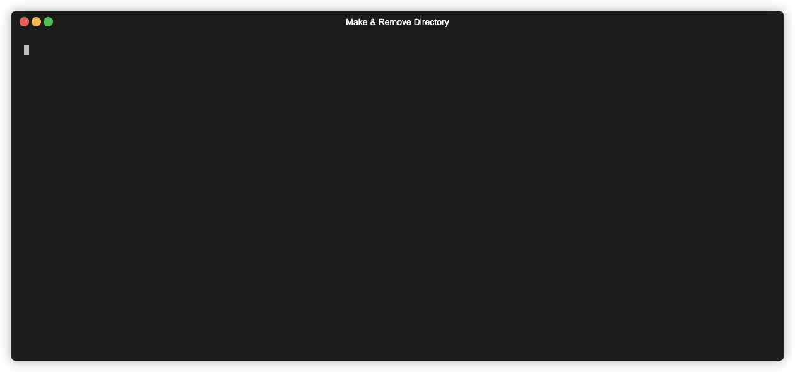

# Lesson 1
Provides a foundation by going over directory structure and basic file manipulation but will begin with a brief intro.

In order to form a basis for the upcoming lessons it's helpful to define what a programming shell is and go over some terminology.
A shell is a program which exposes the OS and is called so because it's the outermost layer around it.
The program can either be a GUI (like the mac or windows interface you are familiar with), or a command line interface (CLI).
For these lessons the focus will be on the CLI that Unix and Linux provide.
This interface is both an interactive command-line interpreter and means for executing scripts.

To understand what that means, think of the shell as being somewhat analogous to the javascript console found in web browsers' developer tools.
The console provides a means of executing arbitrary Javascript and can be considered as a shell to the browser itself.
It's safe to assume that these console themselves have been heavily inspired by Unix shells.

Using the shell is sometimes simply called _bash_, which is the most popular shell for Unix & Unix like OS's.
There are other shells like bash's predecessor _sh_ and new variants like _zsh_ (which we installed as a prereq), _fish_, etc.
Fun fact, the proper name for _sh_ is the Bourne Shell and _bash_ is short for Bourne-Again shell.

* https://en.wikipedia.org/wiki/Shell_(computing)
* https://en.wikipedia.org/wiki/Unix_shell

## Exercises
1. Getting familiar with Unix directory structure and the difference between absolute and relative paths.
    * Directory structure is at the heart of all shell programming and is relevant for almost every command
    * Directories (ie folders) is how all your files are organized on your computer and can be thought of as a [tree structure](../static/UnixDirectoryStructure.png)
    * Examples of a valid directory are `/`, `/tmp`, `/Users/Shared`, and `/Library/Apple/usr/share/`
    * The root directory `/` is the "trunk" of the directories and all other directories are children or its descendants
    * Each occurrence of `/` in a path means the item on the right of the `/` is inside the directory to the left of `/`. 
      * In the example `/Users/Shared` can be read **Shared** is inside the directory **Users**
    * There is also a special directory denoted by the tilde `~` character, which is the users respective home directory (more on this later)
    * When using a command either absolute or relative paths may be used.
    * An absolute path is a path that contains the root directory `/`
    * A relative path is one that is respective of your current location in the file system.
        * Ex1: you are presently in the `/Users/home` directory that contains a file called **"myfile"** and then relative path to it is simply `myfile`
        * Ex2: you are presently in the `/Users/home` directory that contains a folder named `/mystuff` that has a file called **"myfile"** and the relative path to the file is `mystuff/myfile`
    * When relative pathing is used there are two special characters that can be used
        * A single dot or period `.` means the current directory, therefore the relative paths `mystuff` and `./mystuff` are equivalent
        * Two dots or periods `..` means the parent directory, therefore if you are in the folder `/Users/home` then `..` is the `/Users` directory
1. The current directory: `pwd`
1. Change directory: `cd`
    * `cd /`
    * `cd /Users/[your username]`
    * `cd ~` and try `pwd` to confirm
    * `cd ..`
    * 
1. Use tab completion
    * `cd ` and press tab twice then make a choice followed by tab twice again
    * 
1. Make directory: `mkdir`
    * `cd ~`
    * `mkdir mystuff`
    * `cd mystuff`
1. Delete directory: `rmdir`
    * `cd ..`
    * `rmdir mystuff`
    * 
1. Your first file manipulation: `touch`
    * `mkdir mystuff`
    * `touch firstfile`  
    * `touch mystuff/myfile`
1. List Directory: `ls`
    * `ls`
    * list form: `ls -l`
    * `touch ./myfile2`
    * list in modified order: `ls -lt`
    * list in reversed modified order: `ls -ltr`
1. Move: `mv`
   * `mv myfile2 mystuff/myfile2`
   * `touch myfile3`
   * `mv myfile3 mystuff/`
   * `touch movefile`  
   * `mv movefile anotherfilename`
   * Note: will overwrite files
   * 
1. Copy: `cp`
    * `cp firstfile myfilecopy`
    * `mkdir newfolder`
    * `cp myfilecopy newfolder/`
    * Lets try with a mix of relative & absolute paths
    * `cp firstfile ~/firstfilecopy`
      * Note: **~/** is an absolute path and is a special short-hand way of typing your home directory
    * Note: will overwrite files
1. Remove: `rm`
    * `rm anotherfilename`
    * `touch filetodelete1`
    * `touch newfolder/filetodelete2`
    * `rm filetodelete1 newfolder/filetodelete2`
      * Note: you can remove any number of files in a single command as you like
    * 
1. Using Copy & Remove with the recursive (`-r`) option:
    * Normally copy & remove only respect files
    * Using the `-r` option will allow you to manipulate directories as well
    * `cp -r newfolder mystuff`
    * `ls -ltr mystuff/`    
    * Recursive option is also available for `rm`
    * `rm -rf mystuff/newfolder`
    * Note: The `-f` in `rm` skips the confirmation prompt
1. Using `mv` on entire directories
    * Unlike `cp` & `rm` it doesn't need any special options to move folders
    * `mv newfolder mystuff/`
    * `ls -ltr` 
    * `ls -ltr mystuff`
1. The wildcard character `*`
    * The wildcard character is a simple regular expression that matches any character
    * It can be used to manipulate parts of or entire contents of a directory
    * `cp mystuff/my* .`
    * `rm myf*`
    * 
    
